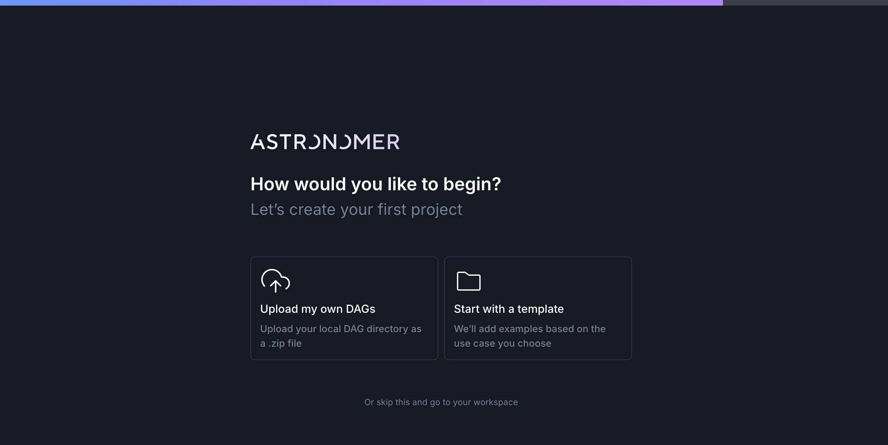
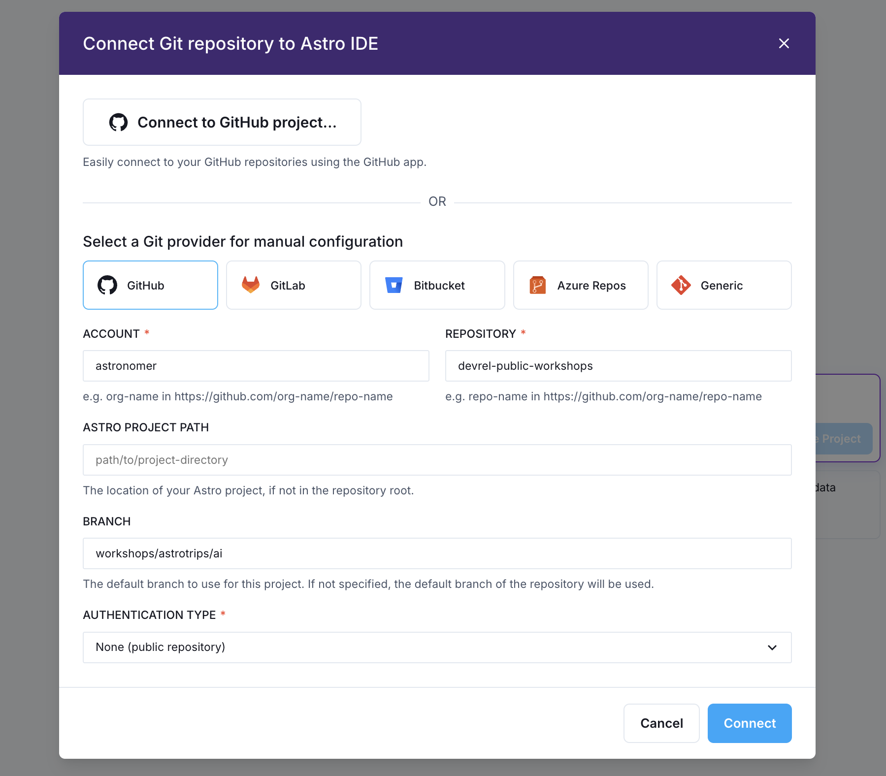
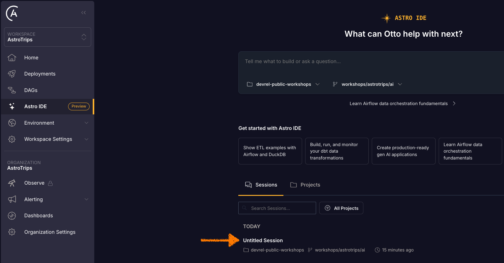
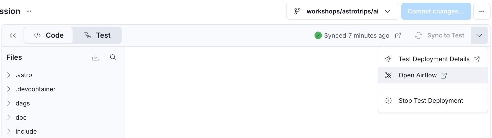
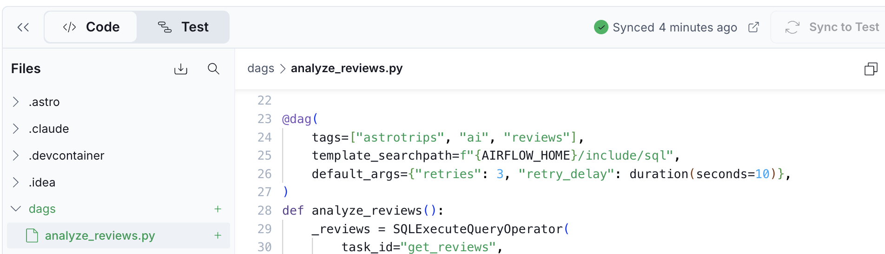

# Airflow Dag Writing Workshop

## Exercises

- [Exercise 0: Astro and Astro IDE](#exercise-0-astro-and-astro-ide)
- [Exercise 1: Connect your Dags with assets](#exercise-1-connect-your-dags-with-assets)
- [Exercise 2: Dynamic task mapping](#exercise-2-dynamic-task-mapping)
- [Exercise 3: Dag parameters](#exercise-3-dag-parameters)
- [Exercise 4: Avoid top-level Dag code](#exercise-4-avoid-top-level-dag-code)
- [Exercise 5: Write a Dag validation test](#exercise-5-write-a-dag-validation-test)

The exercise Dags live in [`dags/exercises`](dags/exercises/). They are tagged with `exercise` as well as their exercise number, so you can filter for them in the Airflow UI. Some exercises can be solved in more than one way.

Inside the Dag files, the parts you need to change are marked like this:

```python
### START CODE HERE ###
### END CODE HERE ###
```

You never have to write a Dag from scratch. You complete Dags that are already there.

## The scenario

AstroTrips is a fictional company that flies passengers to other planets. Customers book trips to destinations like the Moon, Mars and Europa, and every trip needs a launch window.

You are joining the AstroTrips **flight operations** team. No ship leaves the pad until mission control has signed off on a **launch readiness report**. That report pulls together three things:

- The conditions forecast for every planet on the manifest.
- The conditions recorded on the day a given launch window opens, so the forecast can be sanity checked against the archive.
- The solar activity along the transfer trajectory, because a radiation spike grounds a flight.

The Dags that build that report already exist, but they work by accident. They only ever look at one planet, nothing connects them to each other, and the report Dag has no owner, no retries and no cap on how many times it can fail in a row. A fourth Dag, unrelated to the report, does expensive work every single time Airflow parses it. Fixing all of that is the workshop.

---

# Exercise 0: Astro and Astro IDE

## Set up Astro IDE

This workshop does not require any local Airflow installation. Instead, all development takes place within Astro and the Astro IDE. The first step is to set up a **free** Astro trial to run Airflow and access the Astro IDE for Dag development.

> [!NOTE]
> If you are an experienced Airflow user, you can use your local Airflow environment for all the exercises. However, the exercise instructions focus on the Astro IDE for less experienced users who do not have a local setup.

While a deep understanding of the Astro platform is not required, here is a quick overview: Each customer has a dedicated Organization on Astro. An Organization can contain multiple Workspaces (for example, one per team). Each Workspace can have multiple Deployments, where a Deployment is a fully hosted Airflow environment.

1. Create a [free trial of Astro](https://www.astronomer.io/lp/signup/?utm_source=conference&utm_medium=web&utm_campaign=devrel-workshop).

    - After creating an account, verifying your email, and logging in, choose _Personal_ in the first step.
    - Next, choose an _Organization_ and _Workspace_ name. These can be fictional names and you can change them later.
    - In the third step, click the small link at the bottom under the two boxes: _Or skip this and go to your workspace_.

    

    - You should now see the Astro platform UI.

2. Open the _Astro IDE_ from the left navigation and select _Connect Git project..._
3. Under _Select a Git provider for manual configuration_, select _GitHub_ and enter the following details:

    - **ACCOUNT**: `astronomer`
    - **REPOSITORY**: `devrel-public-workshops`
    - _Keep Astro Project Path empty_
    - **BRANCH**: `workshops/astrotrips/dag-writing`
    - **AUTHENTICATION TYPE**: `None (public repository)`
    - Click _Connect_. The IDE will import and open the project for you.

    

**You now have the Astro IDE with the project ready to go.**


> [!NOTE]
> You don't need to commit your changes. If you want to keep your code after the workshop, fork the repository first.

> [!TIP]
> The Astro IDE comes with an integrated AI assistant, optimized for workflow orchestration with Apache Airflow. Feel free to interact with it during this workshop to learn more about certain concepts.

## Start the test deployment

The final setup step is to start a test deployment, a fully functional Airflow environment that runs the Dags you work on in the following exercises.

> [!CAUTION]
> The Astro IDE organizes work into sessions by project. For this workshop, always work in the same session. If you get lost, return to the Astro IDE start page, which lists your sessions and should show the untitled session that was created automatically when you opened the project.

1. Navigate to the _Astro IDE_ and open your session.

    

2. Click _Start Test Deployment_ in the top right corner. The deployment takes 3-5 minutes to spin up.
3. **While the deployment is starting**, click the dropdown next to _Sync to Test_ and select _Test Deployment Details_.

    

4. Navigate to the _Environment_ tab and click _Edit Deployment Variables_.
5. In the popup, remove the `AIRFLOW__SCHEDULER__USE_JOB_SCHEDULE` variable to enable scheduling for the test deployment.
6. Click _Update Environment Variables_.

    

> [!NOTE]
> Scheduling is disabled by default for test deployments to prevent Dags from running automatically. This gives you maximum control during development and helps avoid unwanted side effects. In Exercise 1 you will schedule a Dag on asset updates, so scheduling needs to be enabled.

7. Back in the Astro IDE session, once the test deployment is ready, select _Open Airflow_ from the same dropdown menu.

    

**Once the Airflow UI loads, your environment is ready.**

## Meet the flight operations Dags

Before you change anything, take a look at what you inherited. Three Dags build the launch readiness report between them:

| Dag id | Shown in the Airflow UI as | What it contributes |
|---|---|---|
| [`planet_conditions`](dags/exercises/planet_conditions.py) | 1./2. Exercise: Planet conditions 🌤️ | The forecast conditions for every planet on the manifest. |
| [`launch_window_history`](dags/exercises/launch_window_history.py) | 1. Exercise: Launch window history 🌦️ | The archived conditions and solar activity for one planet on the day its launch window opens. |
| [`launch_readiness_report`](dags/exercises/launch_readiness_report.py) | 1./3. Exercise: Launch readiness report 📒 | Collects both of the above and writes the report mission control reads. |

There is also [`top_level_code`](dags/exercises/top_level_code.py), shown as _4. Exercise: top_level_code_. It has nothing to do with the report. It is a standalone Dag with a performance problem you will fix in Exercise 4.

> [!IMPORTANT]
> **The Airflow UI shows Dag display names if defined.** These Dags set the `dag_display_name` parameter, so the Dags list reads _1./2. Exercise: Planet conditions 🌤️_ where the code, the tests, the logs and this guide all call that Dag `planet_conditions`, which is the id.
>
> Anything written in `code font` in this guide is a Dag id, a task id or a param name, which is what you will find in the Dag files. The number at the front of each display name tells you which exercises touch that Dag, and it matches the Dag's tags, which you can filter by in the UI.

Unpause all four Dags in the Airflow UI, then trigger `planet_conditions` with default parameters. Open the Dag Run view of the run you just triggered, and open the logs of the `create_conditions_table` task.

The conditions table only has one column, even though you requested three planets with the default Dag parameters.

Now trigger `launch_window_history`, again with default parameters. Notice how the `launch_readiness_report` never runs on its own, because nothing connects it to the two Dags above.

These two things are wrong, and you will fix both in the following exercises.

> [!TIP]
> You will see only these four Dags in the UI, and that is on purpose. The [`dags/code_syntax_examples`](dags/code_syntax_examples/) folder holds another 14 small, complete Dags showing how individual Airflow features work. They are listed in `dags/.airflowignore`, so Airflow never loads them and your Dags list stays readable. Open them in the IDE to read and copy from, and remove the entry from `dags/.airflowignore` if you want to run one.

---

# Exercise 1: Connect your Dags with assets

Assets make Airflow data-aware. Dags that read and write the same data get an explicit, visible relationship, and a Dag can be scheduled on updates to those assets instead of on a clock alone.

Right now `launch_readiness_report` depends on data from `planet_conditions` and `launch_window_history`, but that dependency exists only in your head. Let's put it in the schedule.

**What you will learn:**

- 💡 Publishing an asset from a task with the `outlets` parameter.
- 💡 Combining assets with `&` and `|` into a conditional schedule.
- 💡 Scheduling a Dag on assets **and** a cron expression with `AssetOrTimeSchedule`.

## Your task

Give `launch_readiness_report` a schedule that runs the Dag:

- every day at midnight UTC **AND**
- whenever both the `planet-conditions` and `launch-temperature` assets are updated **AND** ONE OF the assets `launch-storm-risk` **OR** `launch-visibility` is updated.

To make that possible, three tasks need to start publishing assets. You will modify:

1. The `create_conditions_table` task in [`planet_conditions`](dags/exercises/planet_conditions.py) to produce an update to `Asset("planet-conditions")`.
2. The `get_storm_risk` task in [`launch_window_history`](dags/exercises/launch_window_history.py) to produce an update to `Asset("launch-storm-risk")`.
3. The `get_visibility` task in [`launch_window_history`](dags/exercises/launch_window_history.py) to produce an update to `Asset("launch-visibility")`.
4. The schedule of [`launch_readiness_report`](dags/exercises/launch_readiness_report.py), using an [`AssetOrTimeSchedule`](https://www.astronomer.io/docs/learn/airflow-datasets).

> [!TIP]
> The `get_temperature` task in `launch_window_history` already publishes an asset. Use it as your template for tasks 2 and 3.
>
> For task 4, `AssetOrTimeSchedule` and `CronTriggerTimetable` are already imported at the top of the file, and the assets are already defined as constants. Use parentheses `()` rather than brackets `[]` around the asset expression, otherwise you cannot use the conditional operators.

See the Dag code comments for more hints.

## Test your changes

1. Sync your changes to the test deployment by clicking _Sync to Test_ within the Astro IDE.
2. Open Airflow and make sure all four Dags are unpaused.
3. Trigger `planet_conditions` and wait for it to finish.
4. Trigger `launch_window_history` and wait for it to finish.
5. `launch_readiness_report` should now start **on its own**.

> [!TIP]
> Open the _Assets_ page in the Airflow UI. It shows every asset in your environment, which task produced the last update, and which Dags are waiting on it. This is the fastest way to see why a Dag did or did not trigger.

---

# Exercise 2: Dynamic task mapping

With dynamic task mapping you can write Dags that adapt to your data at runtime. Airflow creates one task instance per item in a list, and it does that when the Dag runs, not when it is parsed.

`planet_conditions` takes a list of planets as a Dag param, but it only ever looks at the first one. Let's fix that.

**What you will learn:**

- 💡 Creating one task instance per list item with `.expand()`.
- 💡 Passing the mapped output of one task into a downstream task.

## Your task

Dynamically map the `get_id_for_one_planet` task over the list of planets returned by `get_planets` in the [`planet_conditions`](dags/exercises/planet_conditions.py) Dag.

You will modify:

1. The `get_planets` task, so it returns all planets in the param instead of only the first one.
2. The call to `get_id_for_one_planet`, so it is mapped over that list.

See the Dag code comments and the [dynamic task mapping guide](https://www.astronomer.io/docs/learn/dynamic-tasks/) for more hints. For the solution see [`solutions/dags/planet_conditions.py`](solutions/dags/planet_conditions.py).

## Test your changes

1. Sync your changes and trigger `planet_conditions`.
2. Open the Dag run in the grid view.

Check that:

- [ ] `get_id_for_one_planet` shows **three** mapped task instances instead of one.
- [ ] The table in the `create_conditions_table` logs now has a column per planet:

    ```text
    Launch conditions (storm_risk):
    +----------------+--------+--------+----------+
    | reading_date   |   Moon |   Mars |   Europa |
    +================+========+========+==========+
    | 2026-08-26     |   0.74 |   0.17 |     0.39 |
    +----------------+--------+--------+----------+
    ```

> [!TIP]
> Trigger the Dag with the _Trigger Dag w/ config_ option and add or remove planets in the `my_planets` param. The number of mapped task instances follows your input, without any change to the Dag code.

---

# Exercise 3: Dag parameters

Letting tasks retry by default is one of the cheapest reliability wins in Airflow. It handles transient failures and prevents a long series of failed Dag runs. [Dag parameters](https://www.astronomer.io/docs/learn/airflow-dag-parameters/) are where you set that, along with ownership and failure limits.

**What you will learn:**

- 💡 Setting defaults for every task in a Dag with `default_args`.
- 💡 Auto-pausing a Dag after a number of consecutive failed runs.

## Your task

For the [`launch_readiness_report`](dags/exercises/launch_readiness_report.py) Dag:

1. Set all tasks in the Dag to retry 3 times by default and give them a new owner (you).
2. Make sure the Dag never has more than 6 consecutive failed runs.

See the Dag code comments for more hints. For the solution see [`solutions/dags/launch_readiness_report.py`](solutions/dags/launch_readiness_report.py).

> [!TIP]
> [`dags/code_syntax_examples/dag_parameters.py`](dags/code_syntax_examples/dag_parameters.py) is an annotated tour of the most useful Dag parameters. [`retries_dag.py`](dags/code_syntax_examples/retries_dag.py) in the same folder shows retries at the Dag level, at the task level, and for traditional operators.

## Test your changes

1. Sync your changes.
2. Open `launch_readiness_report` in the Airflow UI.

Check that:

- [ ] The owner shown for the Dag is the name you set.
- [ ] Opening any task and looking at its details shows 3 retries.

---

# Exercise 4: Avoid top-level Dag code

Top-level Dag code is an [Airflow anti-pattern](https://www.astronomer.io/docs/learn/dag-best-practices#avoid-top-level-code-in-your-dag-file). The Dag processor executes every `.py` file in your Dags folder on a schedule, so any code that is not inside a task runs on every single parse, whether the Dag runs or not. Slow top-level code makes every Dag in the environment slower to parse, and past a certain point your Dags stop appearing at all.

**What you will learn:**

- 💡 Recognising top-level code in a Dag file.
- 💡 Moving expensive work into a task so it runs when the Dag runs.

## Your task

Rewrite the [`top_level_code`](dags/exercises/top_level_code.py) Dag so the call to `expensive_trajectory_calculation()` happens inside a task. Then you can proceed to calculate the optimal trajectory correction.

For the solution see [`solutions/dags/top_level_code.py`](solutions/dags/top_level_code.py).

> [!TIP]
> Want to see the problem for yourself? Increase the `sleep()` in `expensive_trajectory_calculation` in [`include/helper_functions.py`](include/helper_functions.py) before you fix the Dag, and watch how long the Dag takes to show up after a sync. Set it back afterwards.

> [!NOTE]
> Parse cost is per file, so the other half of this lesson is not parsing files you do not need. That is what `.airflowignore` is for. Open [`dags/.airflowignore`](dags/.airflowignore) and you will find the `code_syntax_examples/` folder listed there, which is why those 14 Dags never showed up in your Dags list.

## Test your changes

1. Sync your changes and trigger `top_level_code`.

Check that:

- [ ] The task logs print the trajectory correction.
- [ ] No call to `expensive_trajectory_calculation()` remains outside a task.

---

# Exercise 5: Write a Dag validation test

The Astro CLI and the Astro IDE let you test and debug Dags both inside and outside a running Airflow environment. Wiring those tests into CI is how you keep new Dag code from breaking your organization's standards in production.

This project ships example tests in [`tests`](tests/):

| Folder | What it covers |
|--------|----------------|
| [`tests/dag_validation_tests`](tests/dag_validation_tests/) | Every Dag imports cleanly and sets task retries, plus a separate check that the ignored syntax examples still import. |
| [`tests/unit_tests`](tests/unit_tests/) | The custom operator in [`include/custom_operator.py`](include/custom_operator.py). |
| [`tests/integration_tests`](tests/integration_tests/) | The AstroTrips conditions API and the helpers built on it. |

**What you will learn:**

- 💡 Running the test suite from the Astro IDE.
- 💡 Enforcing a Dag standard with a validation test.

## Your task

1. Run the tests as they are and note the result. `test_dag_retries` fails for `launch_readiness_report` until you complete Exercise 3, and for `top_level_code`, which never sets retries at all. That is the whole point of the test.
2. Update `test_dag_retries` in [`tests/dag_validation_tests/test_dag_validation.py`](tests/dag_validation_tests/test_dag_validation.py) to require at least **3** retries instead of 2.
3. Remove `retries` from the `default_args` of one of your Dags and run the tests again to see the failure.
4. Put the retries back.

> [!TIP]
> The same file has three more validation tests commented out: approved tags, `catchup=False`, and an allow-list of operators. Uncomment one and see what it says about this project.

## How to run the tests

In the Astro IDE, sync your changes and switch to the Test view.



> [!TIP]
> The Test view also lets you run a single Dag without opening Airflow at all. Select a Dag
> from the dropdown, click _Run Dag_, and inspect the logs of any task right there. It is a
> quick way to check your work between exercises.

If you are working locally with the Astro CLI, run:

```bash
astro dev pytest
```

---

# Congratulations

You took a set of Dags that only worked by accident and turned them into a connected, data-aware pipeline:

- 🚀 `planet_conditions` and `launch_window_history` publish assets, and `launch_readiness_report` reacts to them with a conditional `AssetOrTimeSchedule`.
- 🚀 The planet lookup adapts to its input at runtime with dynamic task mapping.
- 🚀 Every task retries, the Dag has an owner, and a run of failures pauses the Dag instead of hammering away.
- 🚀 Expensive work happens when the Dag runs, not every time it is parsed.
- 🚀 Alerts tell you when something breaks, and a validation test stops the next Dag from regressing the standard.

## Where to go next

- Browse [`dags/code_syntax_examples`](dags/code_syntax_examples/) for features this workshop did not cover: callbacks and notifiers, deferrable operators, `execution_timeout`, `.override()`, `run_if` and `skip_if`, and XCom `.concat()`.
- Read the [Dag writing best practices guide](https://www.astronomer.io/docs/learn/dag-best-practices).
- Look at what arrived in Airflow 3 that this workshop touched only in passing: [human-in-the-loop operators](https://www.astronomer.io/docs/learn/airflow-human-in-the-loop), Dag versioning, and asset partitions.

Thank you for joining. 🛰️
